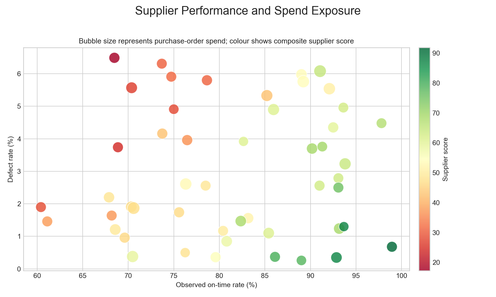
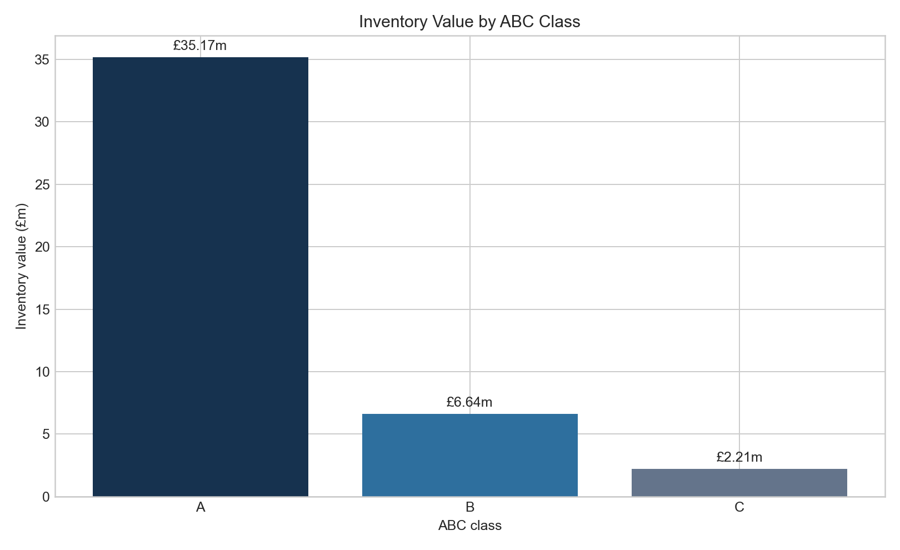
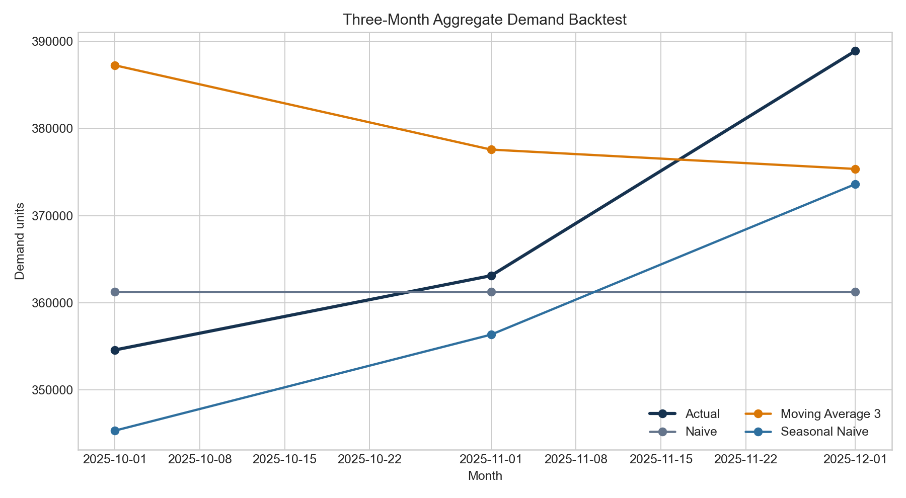

# Supply Chain Operations Analytics

This self-directed project applies Python to supplier performance, purchasing exposure, inventory priorities and demand forecasting. It translates the operational questions I handled professionally into one analytical workflow using demonstration manufacturing data.

## Operational scope

The analysis answers three practical questions:

1. Which suppliers combine poor service with material spend exposure?
2. Which products need immediate replenishment attention?
3. Which transparent forecasting baseline should planning teams use before adding model complexity?

The data is synthetic, while the choice of questions reflects my work across imports, procurement, logistics, Oracle ERP and daily supplier reporting.

## Professional relevance

At Ibrahim Fibres, I worked across imported and local purchasing, machinery and spare parts, raw materials, letters of credit, customs, shipment tracking, transport and Oracle processing. I also maintained daily Excel reporting on shipment position, lead time, delivery and supplier performance. This repository converts that operational perspective into a public analytical example without reproducing an employer process, system or dataset.

The scenarios are deliberately recognisable to an operations team: a late supplier matters more when spend or material dependence is high; a below-reorder item matters more when it holds a large share of inventory value; and a forecasting method should earn complexity through chronological out-of-sample performance. The code demonstrates how I structure those decisions, while every numerical result comes from the synthetic files in this repository.

## Result snapshot

| Decision area | Result | Management use |
| --- | ---: | --- |
| Purchase-order spend reviewed | £37.24m | Quantifies the commercial exposure covered by the analysis |
| Delayed-order rate | 18.62% | Establishes the delivery-performance baseline |
| High-risk suppliers | 4 of 50 | Focuses supplier reviews on low-score, high-spend relationships |
| Inventory value classified | £44.02m | Creates an ABC view of working-capital concentration |
| Products below reorder point | 62 of 500 | Identifies the replenishment queue |
| Immediate Class A actions | 1 | Isolates the highest-value stockout risk |
| Best three-month backtest | 9.87% WAPE | Selects the three-month moving average over naive alternatives |

The moving-average baseline reduced WAPE from 10.40% for the last-value naive model and 13.03% for seasonal naive. The result is useful because the evaluation is a chronological holdout rather than an in-sample fit.

## Supplier performance

The supplier scorecard combines observed purchase-order delivery performance with defect rate, lead time and average delay. Purchase-order spend is retained as a separate exposure measure, so a low operational score has greater priority when commercial dependence is also high.

The output is written to [`outputs/supplier_scorecard.csv`](outputs/supplier_scorecard.csv) with a transparent risk classification of `High`, `Monitor` or `Controlled`.

## Inventory priorities

Products are ranked by inventory value and assigned to ABC classes using cumulative value thresholds of 80% and 95%. The pipeline then combines class with the reorder gap:

- `Immediate`: Class A and below the reorder point
- `Review`: Class B or C and below the reorder point
- `Routine`: no current replenishment trigger

This separation prevents a long stockout list from hiding the items with the greatest working-capital and service impact.

## Forecast evaluation

Every product is backtested over its final three months using the same chronological split. The project compares:

- last-value naive
- recursive three-month moving average
- seasonal naive with a 12-month lag

The full item-level predictions are available in [`outputs/forecast_backtest_predictions.csv`](outputs/forecast_backtest_predictions.csv), and the model comparison is in [`outputs/forecast_metrics.csv`](outputs/forecast_metrics.csv).

## Quality controls

The analysis fails before KPI calculation if any dataset has missing required fields, null cells or duplicate rows. Unit tests check inventory classification and forecast evaluation, while the GitHub Actions workflow runs the tests on every push and pull request.

The current validation report covers:

| Dataset | Rows | Columns | Status |
| --- | ---: | ---: | --- |
| Suppliers | 50 | 8 | Pass |
| Purchase orders | 5,000 | 10 | Pass |
| Inventory | 500 | 8 | Pass |
| Demand history | 12,000 | 3 | Pass |

## Repository guide

| Area | What it contains |
|---|---|
| `data/` | Four demonstration datasets and their data dictionary |
| `src/` | Data validation, supplier scoring, inventory classification and forecast evaluation logic |
| `scripts/` | The end-to-end analysis workflow |
| `outputs/` | Supplier scorecards, inventory priorities, backtest predictions, metrics and figures |
| `tests/` | Checks for data grain, classification logic and forecast evaluation |

The saved outputs make the complete decision trail visible without requiring the reader to configure a local Python environment.

## Limits and next development steps

The data is synthetic and the forecasting methods are intentionally transparent baselines. A production implementation would add supplier criticality, order-line service measures, demand hierarchy reconciliation, probabilistic safety-stock estimates and automated data ingestion. Those additions should follow a stable, monitored baseline.

## Author

**Muhammad Ahmed Shoaib** 
MSc Business Analytics, Queen's University Belfast 
Supply chain operations experience across imports, procurement, customs, logistics and Oracle ERP

[LinkedIn](https://www.linkedin.com/in/ahmed-shoaibed) | [Email](mailto:mshoaib01@qub.ac.uk)
